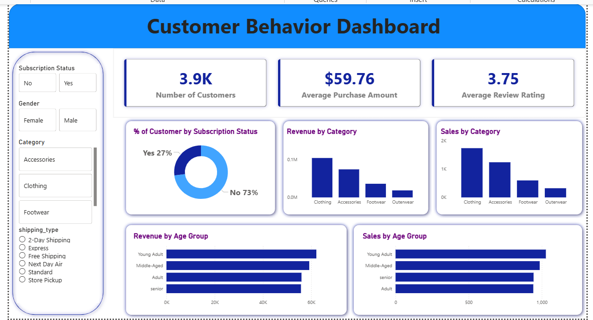

# 🛍️ Customer-Shopping-Behavior-Analysis

Interactive **Power BI dashboard** for analyzing customer shopping behavior, spending patterns, and product performance.

## 📌 Overview
This project focuses on **Customer Shopping Behavior Analysis** using **Python, SQL, and Power BI**. The goal is to transform raw shopping data into meaningful business insights that help organizations understand **customer purchasing patterns, spending trends, and product category performance**.

## 📂 Repository Contents

* 📊 **Customer_Behavior_Dashboard.pbix** → Power BI Dashboard File
* 📄 **customer_shopping_behavior.csv** → Raw Dataset
* 📄 **customer-behavior.sql** → SQL Queries for Business Analysis
* 📓 **Customer-Trends.ipynb** → Data Cleaning & Exploratory Data Analysis
* 📘 **README.md** → Project Documentation

## 🎯 Project Objectives
* Analyze customer spending behavior and purchasing trends.
* Identify top-performing product categories.
* Evaluate demographic factors influencing purchase amounts.
* Perform SQL-based business analysis for actionable insights.
* Build an interactive dashboard for sales and customer analysis.

## 🛠️ Tools & Technologies
* **Python** (Pandas, NumPy, Matplotlib, Seaborn)
* **SQL** (Business Queries & Data Analysis)
* **Power BI** (Data Modeling, DAX & Visualization)
* **Power Query** (Data Extraction & Transformation)
* **Jupyter Notebook** (EDA & Cleaning Workflow)

## 💡 Data Analysis & Business Intelligence

### 📊 Dashboard Highlights

* **Sales Overview:** Total sales, customer count, and average purchase value.
* **Customer Insights:** Spending behavior by age group and gender.
* **Product Performance:** Revenue contribution by product categories.
* **Trend Analysis:** Identification of high-performing customer segments.
* **Interactive Filtering:** Dynamic slicers for category, gender, and age analysis.

## 🧹 Data Cleaning & Preparation
Performed using **Python (Pandas)**:
* Removed duplicate records
* Handled missing values
* Standardized column names
* Converted appropriate data types
* Cleaned inconsistent categorical values
* Prepared the dataset for SQL analysis and Power BI visualization
* 
## 🗃️ SQL Business Analysis

Key business questions answered using SQL:

* 💰 What is the **total revenue generated**?
* 🏆 Which **product categories generate the highest sales**?
* 👤 Who are the **highest spending customers**?
* 📊 What is the **average purchase amount by gender**?
* 📈 Which **age groups contribute most to revenue**?

### Example Query
```sql
SELECT gender,
       ROUND(AVG(purchase_amount), 2) AS avg_purchase
FROM customer_shopping_behavior
GROUP BY gender;
```

## 🖼️ Dashboard Preview

### Page 1: Customer Shopping Overview



---

## 🚀 Key Insights

* **High-Value Categories:** Certain product categories contribute a significantly larger share of total revenue.
* **Demographic Trends:** Young and middle-aged customers show stronger purchasing activity.
* **Spending Patterns:** Customer spending varies across demographic segments and shopping preferences.
* **Interactive BI Model:** The Power BI data model supports dynamic cross-filtering between customer demographics, products, and sales metrics.

## 🔮 Future Improvements

* 🔌 Connect a **live retail database or e-commerce API** for real-time sales tracking.
* 🤖 Add **predictive analytics** to identify high-value or churn-risk customers.
* 🔄 Automate **scheduled data refreshes** for continuously updated dashboards.
* 📈 Integrate **customer segmentation and recommendation models** for deeper business intelligence.

## 👤 Author

### **Sara Fatima**

💼 **Data Analytics Enthusiast | Power BI Developer**

🔗 GitHub: **https://github.com/Sara-Fatima96**

---

## ⭐ Support

If you like this project, feel free to support it by:

* ⭐ **Giving a star to the repository**
* 🍴 **Forking it for your own learning**
* 📢 **Sharing it with others**

---

## 📌 About

**Interactive Power BI dashboard for analyzing customer shopping behavior, sales trends, customer demographics, and product performance using Python, SQL, and Power BI.**

